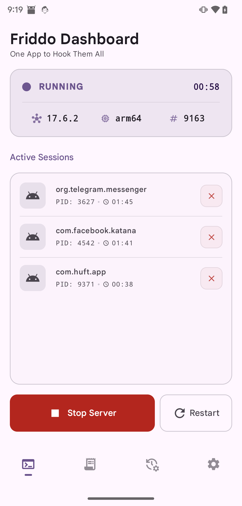
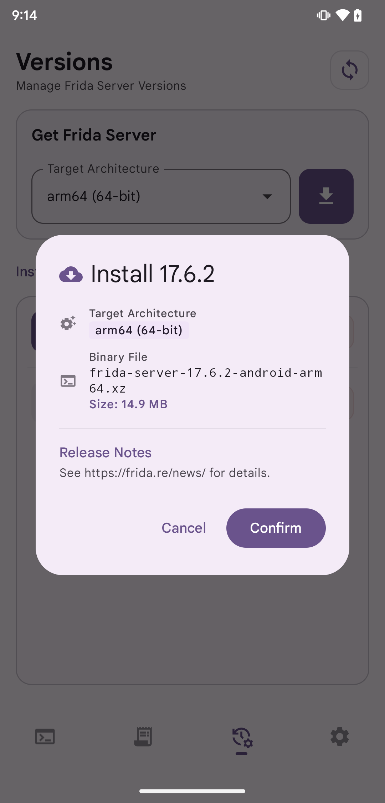
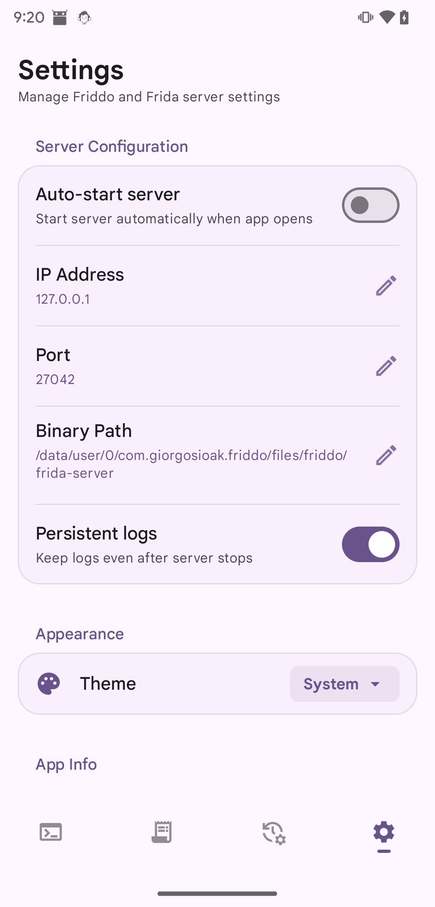

# Friddo

Friddo is an Android utility for managing and running `frida-server` on rooted devices.

## Features

- Browse available Frida server releases
- Cache release metadata locally to avoid unnecessary refreshes
- Download and install matching `frida-server` binaries
- Pick the active installed version
- Start, stop, and restart the local Frida server
- View basic logs and active hooked sessions

## Screenshots

<p align="center">
  
  
  
</p>

Screens shown above:

- Dashboard
- Version install flow
- Settings

## Requirements

- Android 11 or newer
- Root access via `su`
- A device architecture supported by upstream Frida releases

## Build

```bash
./gradlew assembleDebug
```

For a release build:

```bash
./gradlew assembleRelease
```

## Notes

- Friddo does not bundle `frida-server`; it downloads release assets from the upstream Frida project on demand.
- The app is designed for advanced users, reverse engineers, and security researchers.
- Root access is required for starting and controlling `frida-server`.

## License

Friddo is licensed under the GNU General Public License v3.0. See [LICENSE](LICENSE).

## Credits

Hobbit by Rodrigo Vidinich from <a href="https://thenounproject.com/browse/icons/term/hobbit/" target="_blank" title="Hobbit Icons">Noun Project</a> (CC BY 3.0)
